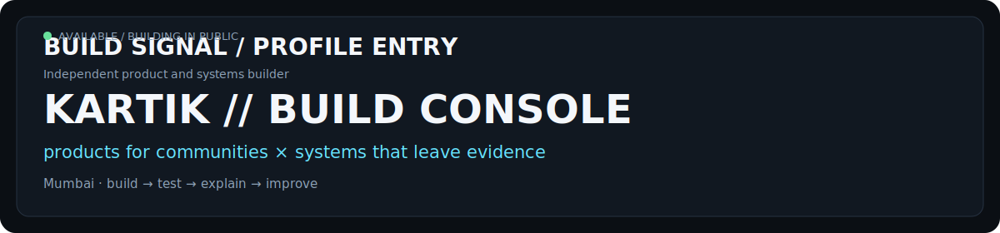
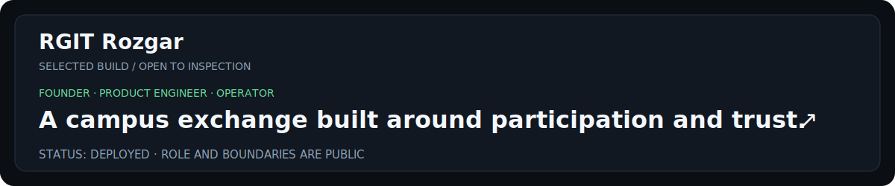
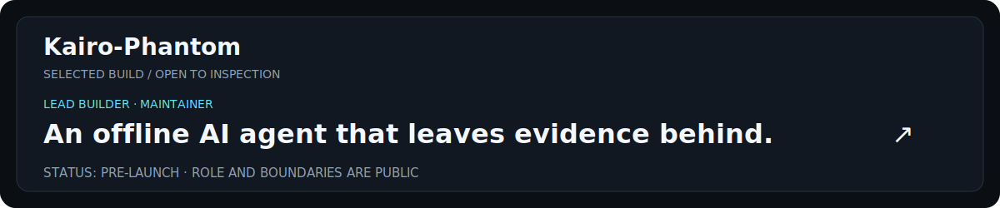
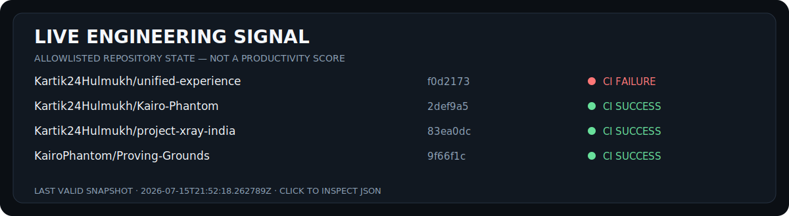

<div align="center">
  <a href="https://github.com/Kartik24Hulmukh?tab=repositories"></a>
</div>

<p align="center">
  <strong>Founder-led community products · Local-first AI · Replayable engineering evidence</strong><br/>
  <sub>I build the product, test the claim, and publish the boundary.</sub>
</p>

<p align="center">
  <a href="https://rgitrozgar.in">Live product</a> ·
  <a href="https://github.com/Kartik24Hulmukh/Kairo-Phantom">Inspect a system</a> ·
  <a href="#run-an-experiment">Run an experiment</a> ·
  <a href="https://github.com/Kartik24Hulmukh/Kartik24Hulmukh/issues/new?template=challenge-claim.yml">Challenge a claim</a>
</p>

## Two tracks. One operating rule.

<table>
<tr>
<td width="50%" valign="top">

### Products for real communities

**RGIT Rozgar** is a campus platform I founded, built, deployed, and maintain for accommodation, resale, academic resources, food services, and nearby healthcare.

[Open the live product →](https://rgitrozgar.in)

</td>
<td width="50%" valign="top">

### Systems that leave evidence

I work on local-first agents and developer tools whose outputs can be checked without trusting the system's own explanation.

[Inspect Kairo-Phantom →](https://github.com/Kartik24Hulmukh/Kairo-Phantom)

</td>
</tr>
</table>

## Selected builds

<a href="https://rgitrozgar.in"></a>

<a href="https://github.com/Kartik24Hulmukh/Kairo-Phantom"></a>

<table>
<tr>
<td width="50%" valign="top">

#### Project X-Ray India
**Engineering contributor · public beta**

Source-linked public-infrastructure claims for human investigation. It supports review; it does not determine corruption.

[Review the repository →](https://github.com/Kartik24Hulmukh/project-xray-india)

</td>
<td width="50%" valign="top">

#### Proving Grounds
**Builder · contributor · experimental**

Runs explicit behavioral claims against code revisions and emits replayable evidence capsules. Bounded evidence—not formal proof.

[Explore the build kit →](https://github.com/KairoPhantom/Proving-Grounds)

</td>
</tr>
</table>

## Live engineering signal

<a href="./data/snapshot.json"></a>

<sub>Generated from allowlisted public repositories. A passing check is repository state—not a quality score or security certification. [Inspect the source data](./data/snapshot.json).</sub>

## Run an experiment

<details>
<summary><strong>01 · Test Kairo's declared zero-egress surface</strong></summary>

```bash
git clone https://github.com/Kartik24Hulmukh/Kairo-Phantom.git
cd Kairo-Phantom
python -m pytest tests/test_airgap_zero_egress.py -q
```

Published repository snapshot: `12 passed · 0 outbound connections detected`.

**Boundary:** this covers the declared test surface and environment. It is not a universal security certification or independent third-party validation.
</details>

<details>
<summary><strong>02 · Inspect a code-change evidence capsule</strong></summary>

Open [Proving Grounds](https://github.com/KairoPhantom/Proving-Grounds), select an example capsule, then compare the declared claim, base/head revisions, commands, results, and adversarial probes.

**Boundary:** the capsule is executable evidence for a scoped claim—not formal verification and not a replacement for review.
</details>

<details>
<summary><strong>03 · Challenge the profile itself</strong></summary>

If a role, metric, maturity label, or technical statement is too broad, [open a claim challenge](https://github.com/Kartik24Hulmukh/Kartik24Hulmukh/issues/new?template=challenge-claim.yml). Reproductions can be submitted through the dedicated issue form.
</details>

## On the bench

<!-- NOW:START -->
- Separate producer and verifier implementations for agent receipts.
- Detect deliberately weakened tests instead of rewarding convincing patch prose.
- Preserve uncertainty in public-interest software without making the product unusable.
<!-- NOW:END -->

## One failure worth keeping

> **Presentation came before governance in early RGIT Rozgar work.** The correction was structural: permissions, review workflows, policies, security controls, and automated tests became foundations rather than polish.

[Read the operating notes and claim policy →](./docs/OPERATING_NOTES.md)

## Contact

Mumbai, India · Computer Engineering student · Gumloop learning cohort and community

[Email](mailto:kartikhulmukh24@gmail.com) · [LinkedIn](https://www.linkedin.com/in/kartik-hulmukh-74081236a/) · [RGIT Rozgar](https://rgitrozgar.in) · [Repositories](https://github.com/Kartik24Hulmukh?tab=repositories)
