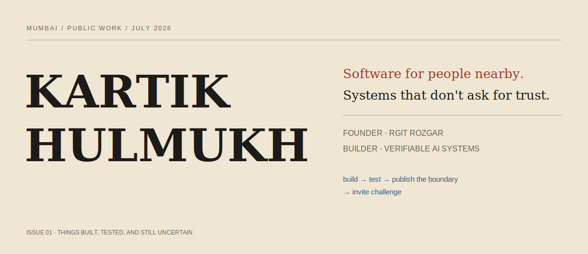
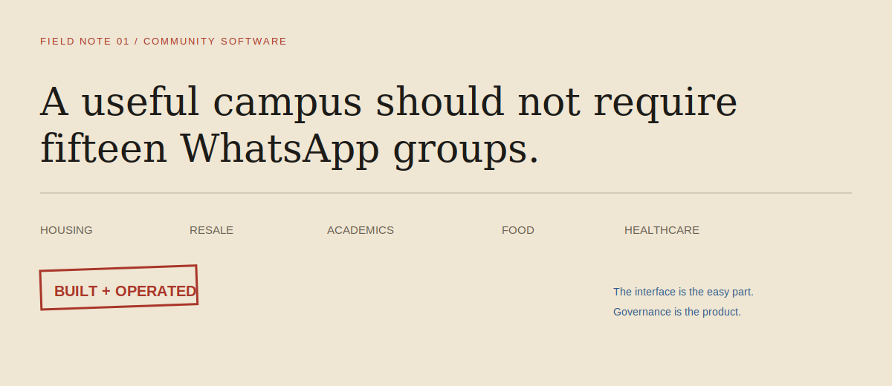
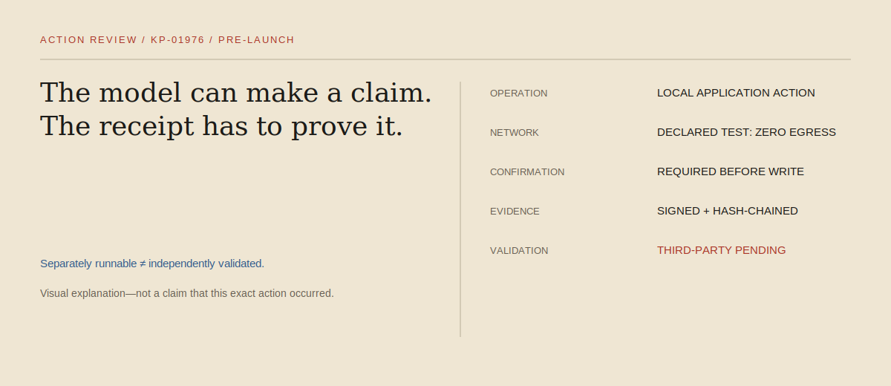
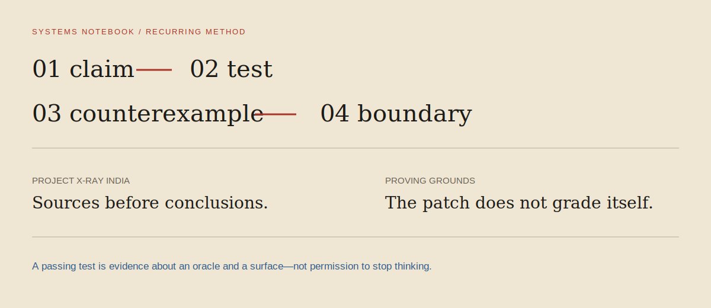

<picture>
  <source media="(prefers-color-scheme: dark)" srcset="./assets/masthead-dark.svg">
  <source media="(prefers-color-scheme: light)" srcset="./assets/masthead-light.svg">
  
</picture>

I build at two scales: the immediate problems students face around me, and the deeper trust problems that appear when software acts on someone's behalf.

**Mumbai · Computer Engineering · community technology founder · open-source systems builder**

[Live product](https://rgitrozgar.in) · [Source](https://github.com/Kartik24Hulmukh?tab=repositories) · [Public evidence](https://kartik24hulmukh.github.io/Kartik24Hulmukh/) · [Write to me](mailto:kartikhulmukh24@gmail.com)

---

## Field note 01 · RGIT Rozgar

<picture>
  <source media="(prefers-color-scheme: dark)" srcset="./assets/rgit-dark.svg">
  <source media="(prefers-color-scheme: light)" srcset="./assets/rgit-light.svg">
  
</picture>

I founded, designed, built, deployed, and maintain **[RGIT Rozgar](https://rgitrozgar.in)** ([source](https://github.com/Kartik24Hulmukh/unified-experience)): one governed place for accommodation, resale, academic resources, food services, and nearby healthcare.

The difficult part is not the listing grid. It is participation, moderation, permissions, disputes, deployment, and keeping the service useful after launch.

**Public boundary:** campus-specific. I publish adoption figures only when they are measured.

---

## Receipt 02 · Kairo-Phantom

<picture>
  <source media="(prefers-color-scheme: dark)" srcset="./assets/kairo-receipt-dark.svg">
  <source media="(prefers-color-scheme: light)" srcset="./assets/kairo-receipt-light.svg">
  
</picture>

**[Kairo-Phantom](https://github.com/Kartik24Hulmukh/Kairo-Phantom)** is a pre-launch local-first desktop agent. Consequential actions require human confirmation; actions produce signed, hash-chained records that a separately runnable verifier can inspect.

I work on it as **lead builder and maintainer** while preserving its upstream history from [`KairoPhantom/Kairo-Phantom`](https://github.com/KairoPhantom/Kairo-Phantom).

<details>
<summary><strong>Reproduce one published repository result</strong></summary>

```bash
git clone https://github.com/Kartik24Hulmukh/Kairo-Phantom.git
cd Kairo-Phantom
python -m pytest tests/test_airgap_zero_egress.py -q
```

Published snapshot: `12 passed · 0 outbound connections detected`

This is evidence for the declared test surface and environment—not universal security certification or third-party validation. [Inspect the benchmark](https://github.com/Kartik24Hulmukh/Kairo-Phantom/blob/master/BENCHMARKS.md).
</details>

---

## Systems notebook

**03.1 · [Project X-Ray India](https://github.com/Kartik24Hulmukh/project-xray-india)**  
Source-linked public-infrastructure claims for human review. It preserves uncertainty and supports investigation; it does not determine corruption. **Role: engineering contributor.**

**03.2 · [Proving Grounds](https://github.com/KairoPhantom/Proving-Grounds)**  
Runs explicit behavioral claims across code revisions and emits replayable evidence capsules. It produces bounded executable evidence—not formal proof. **Role: builder and contributor.**

<picture>
  <source media="(prefers-color-scheme: dark)" srcset="./assets/notebook-dark.svg">
  <source media="(prefers-color-scheme: light)" srcset="./assets/notebook-light.svg">
  
</picture>

---

## Corrections desk

If a public statement is wrong, too broad, stale, or missing a limitation, do not take my word for it:

[Challenge a claim](https://github.com/Kartik24Hulmukh/Kartik24Hulmukh/issues/new?template=challenge-claim.yml) · [Submit a reproduction](https://github.com/Kartik24Hulmukh/Kartik24Hulmukh/issues/new?template=submit-reproduction.yml) · [Inspect the evidence atlas](https://kartik24hulmukh.github.io/Kartik24Hulmukh/) · [Local evidence files](./docs/)

<details>
<summary><strong>Repository state and automation</strong></summary>

The profile repository collects revision, completed CI state, and real releases only from an explicit allowlist. Generated state is stored in [`data/snapshot.json`](./data/snapshot.json). A passing workflow is repository state—not a quality, adoption, or security score.
</details>

---

> **No source → no answer.  
> No oracle → no claim.  
> No negative test → no confidence.**

Mumbai, India · [Email](mailto:kartikhulmukh24@gmail.com) · [LinkedIn](https://www.linkedin.com/in/kartik-hulmukh-74081236a/)
