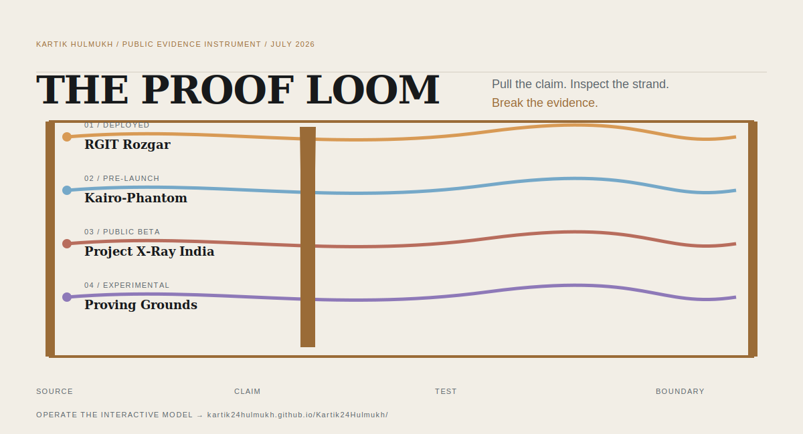

<div align="center">
  <a href="https://kartik24hulmukh.github.io/Kartik24Hulmukh/">
    <picture>
      <source media="(prefers-color-scheme: dark)" srcset="./assets/proof-loom-dark.svg">
      <source media="(prefers-color-scheme: light)" srcset="./assets/proof-loom-light.svg">
      
    </picture>
  </a>
</div>

# Kartik Hulmukh

**I build useful software and the evidence needed to challenge what it claims.**

Mumbai · Computer Engineering · Founder of RGIT Rozgar · Builder of local-first and verifiable systems

[**Operate the Proof Loom →**](https://kartik24hulmukh.github.io/Kartik24Hulmukh/) · [Direct project index](https://kartik24hulmukh.github.io/Kartik24Hulmukh/?view=simple) · [Email](mailto:kartikhulmukh24@gmail.com) · [LinkedIn](https://www.linkedin.com/in/kartik-hulmukh-74081236a/)

## Two systems worth opening first

### [RGIT Rozgar](https://rgitrozgar.in)

**Founder · Product Engineer · Operator**

A deployed campus resource platform for accommodation, resale, academic resources, food services, and nearby healthcare. I designed, built, deployed, and maintain it. Its difficult parts are participation, moderation, permissions, disputes, and continued operation—not the listing grid.

**Boundary:** campus-specific. Adoption figures are published only when measured.

### [Kairo-Phantom](https://github.com/Kartik24Hulmukh/Kairo-Phantom)

**Lead Builder · Maintainer · Pre-launch**

A local-first desktop agent with human confirmation for consequential actions and signed, hash-chained action records that a separately runnable verifier can inspect.

```bash
git clone https://github.com/Kartik24Hulmukh/Kairo-Phantom.git
cd Kairo-Phantom
python -m pytest tests/test_airgap_zero_egress.py -q
```

Published repository snapshot: `12 passed · 0 outbound connections detected`

**Boundary:** evidence for the declared test surface and environment—not universal security certification or independent third-party validation.

## Also in the weave

- **[Project X-Ray India](https://github.com/Kartik24Hulmukh/project-xray-india)** — engineering contributor; source-linked public-infrastructure claims for human investigation. It does not determine corruption.
- **[Proving Grounds](https://github.com/KairoPhantom/Proving-Grounds)** — builder and contributor; behavioral claims tested across revisions with replayable evidence capsules. Bounded executable evidence, not formal proof.

## Challenge the profile

[Challenge a claim](https://github.com/Kartik24Hulmukh/Kartik24Hulmukh/issues/new?template=challenge-claim.yml) · [Submit a reproduction](https://github.com/Kartik24Hulmukh/Kartik24Hulmukh/issues/new?template=submit-reproduction.yml) · [Inspect the evidence manifest](./docs/data/evidence.json)

<sub>The immersive experience is optional. Every essential claim, boundary, project link, and contact path remains available as semantic text.</sub>
