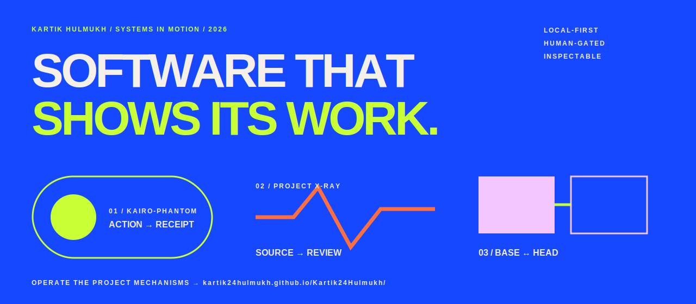

<picture>
  <source media="(prefers-color-scheme: dark)" srcset="./assets/hero-dark.svg">
  <source media="(prefers-color-scheme: light)" srcset="./assets/hero-light.svg">
  
</picture>

## I build software that shows its work.

Computer Engineering student in Mumbai. Lead builder and maintainer of **Kairo-Phantom**; engineering contributor to **Project X-Ray India**; builder and contributor to **Proving Grounds**.

[**Run the interactive profile →**](https://kartik24hulmukh.github.io/Kartik24Hulmukh/) · [LinkedIn](https://www.linkedin.com/in/kartik-hulmukh-74081236a/) · [Email](mailto:kartikhulmukh24@gmail.com)

### Kairo-Phantom — local actions, inspectable receipts

A pre-launch, local-first desktop-agent project with explicit human confirmation and signed, hash-chained action records. The public repository includes fixture-based tests, a separately runnable receipt verifier, and explicit boundaries around experimental capabilities.

[Repository](https://github.com/Kartik24Hulmukh/Kairo-Phantom) · [Project site](https://kartik24hulmukh.github.io/Kairo-Phantom/) · [Reproduce a published test](https://github.com/Kartik24Hulmukh/Kairo-Phantom/blob/master/BENCHMARKS.md)

```bash
python -m pytest tests/test_airgap_zero_egress.py -q
python tools/verify_receipts_external.py redline_output/audit_log.json
```

<sub>Published results describe the declared repository test surfaces. They are not universal security certification or independent third-party validation.</sub>

### Two experiments around inspectable software

- **[Project X-Ray India](https://github.com/Kartik24Hulmukh/project-xray-india)** — source-linked public-infrastructure records organized for human investigation; it does not determine corruption.
- **[Proving Grounds](https://github.com/KairoPhantom/Proving-Grounds)** — behavioral claims compared across revisions with replayable evidence; bounded executable evidence, not formal proof.

### Current direction

I am interested in local-first agents, human confirmation, verifiable action records, grounding, software evaluation, and interfaces that make system behavior easier to inspect.

[Challenge a statement](https://github.com/Kartik24Hulmukh/Kartik24Hulmukh/issues/new?template=challenge.yml) · [Submit a reproduction](https://github.com/Kartik24Hulmukh/Kartik24Hulmukh/issues/new?template=reproduction.yml)
