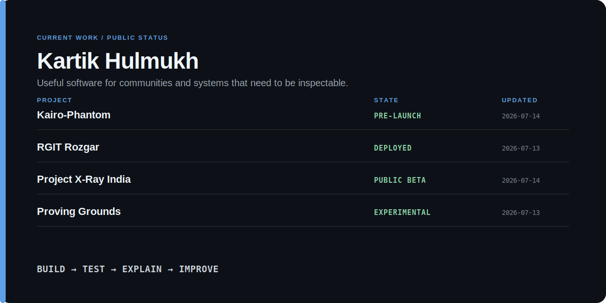

<p align="center">
  
</p>

# Kartik Hulmukh

Computer Engineering student in Mumbai building useful software for communities and systems that need to be inspectable. Useful beats impressive.

I built and maintain [RGIT Rozgar](https://rgitrozgar.in), a campus platform for accommodation, resale, academic resources, food services, and nearby healthcare. I also work on [Kairo-Phantom](https://github.com/Kartik24Hulmukh/Kairo-Phantom), a local-first AI desktop agent that produces signed, independently checkable records of its actions.

```text
build → test → explain → improve
```

[30-second view](#in-30-seconds) · [Current work](#current-work) · [Reproduce a result](#reproduce-one-result) · [Challenge a claim](#challenge-a-claim)

## In 30 seconds

- Built and maintain a deployed campus-resource platform, from product design through backend, database, testing, deployment, and documentation.
- Work on offline AI agents, executable evidence for code changes, public-interest software, and systems that preserve failure context.
- Prefer measured claims, visible limitations, and reproducible commands over broad labels.
- Currently studying Computer Engineering and participating in the Gumloop learning cohort and community.

## Current work

| Project | Why it exists | My work | Proof and current boundary |
|---|---|---|---|
| [Kairo-Phantom](https://github.com/Kartik24Hulmukh/Kairo-Phantom) | Make computer-use agents easier to audit without depending on the agent's own explanation. | Fork maintainer ([upstream](https://github.com/KairoPhantom/Kairo-Phantom)). Agent orchestration, verification, adversarial testing, local-first operation, documentation. | [Benchmarks](https://github.com/Kartik24Hulmukh/Kairo-Phantom/blob/master/BENCHMARKS.md) · pre-launch; independent third-party validation is pending. |
| [RGIT Rozgar](https://rgitrozgar.in) | Bring everyday campus resources into one governed service. | Product, UX, frontend, backend, database, security, tests, deployment, policies. | [Live product](https://rgitrozgar.in) · campus-specific; usage figures are published only when measured. |
| [Project X-Ray India](https://github.com/Kartik24Hulmukh/project-xray-india) | Organize source-linked public-infrastructure claims for human review. | Evidence model, review gates, auditability, release discipline, product implementation. | Public beta; it supports investigation and does not determine corruption. |
| [Proving Grounds](https://github.com/KairoPhantom/Proving-Grounds) | Evaluate code changes against explicit behavioral claims instead of model confidence. | Contributor (under KairoPhantom org). Evidence capsules, adversarial probes, developer-tooling research. | Experimental; bounded executable evidence, not formal verification. |

<!-- dynamic:start -->
## Live repository status

_This block is generated from GitHub's API. It reports repository state, not personal worth or activity theatre._

| Project | Revision | CI | Latest release |
|---|---|---|---|
| Kairo-Phantom | not checked | not checked | not checked |
| RGIT Rozgar | not checked | not checked | not checked |
| Project X-Ray India | not checked | not checked | not checked |
| Proving Grounds | not checked | not checked | not checked |
<!-- dynamic:end -->

## Reproduce one result

Kairo-Phantom's published benchmark reports zero outbound connections across its declared sealed-mode test surface.

```bash
git clone https://github.com/Kartik24Hulmukh/Kairo-Phantom.git
cd Kairo-Phantom
python -m pytest tests/test_airgap_zero_egress.py -q
```

Published snapshot:

```text
12 passed · 0 outbound connections detected
```

This is evidence about the tested interfaces and environment, not a universal security certification. Read the repository's benchmark notes and scope boundaries before relying on the result.

## Challenge a claim

A public claim should be open to inspection.

[Challenge a claim](https://github.com/Kartik24Hulmukh/Kartik24Hulmukh/issues/new?template=challenge-claim.yml) · [Submit a reproduction](https://github.com/Kartik24Hulmukh/Kartik24Hulmukh/issues/new?template=submit-reproduction.yml) · [Report a missing boundary](https://github.com/Kartik24Hulmukh/Kartik24Hulmukh/issues/new?template=challenge-claim.yml)

Useful challenges include:

- a command that does not reproduce the stated result;
- a limitation that is easy to miss;
- a maturity label that does not match the repository;
- evidence that depends too heavily on the project author's own implementation.

## What I am testing now

- Whether agent receipts remain independently verifiable when the producer and verifier use separate implementations.
- Whether a code-change evidence capsule detects deliberately weakened tests rather than rewarding a convincing patch description.
- Which desktop-agent capabilities remain valid outside fixture-backed evaluation.
- How public-interest software can preserve uncertainty without becoming vague or unusable.

## Failure log

| What went wrong or remained uncertain | What changed afterward |
|---|---|
| A clean verification environment did not contain Cargo. | Rust test counts were not presented as independently reproduced. |
| Fixture-backed workflows could be mistaken for general live-GUI reliability. | Live GUI control remains explicitly experimental. |
| Early RGIT Rozgar work emphasized presentation before governance. | Permissions, review workflows, policies, security controls, and automated tests became foundational. |
| Reproducible benchmarks are still maintained by the project author. | Independent reproductions are tracked as a separate requirement rather than implied. |

## Community software

Some of my most useful work starts with a plain question: **what is harder for students than it needs to be?**

That has led to RGIT Rozgar, event-discovery tools, student feedback flows, a counselling intake portal, and peer-learning experiments. These are not presented as large-scale impact claims. They are places where I learned to build around real constraints, ownership, and handoff.

## Learning in public

I am participating in the Gumloop learning cohort and community, working with AI agents, MCP integrations, tool calling, workflows, and automation through practical builds and peer feedback.

The useful loop is simple:

```text
learn → make → test → explain → repeat
```

## How I work

- Start with the user and operating constraint, not the technology label.
- Put consequential actions behind explicit permission or human confirmation.
- Test the failure path, not only the demonstration path.
- Separate verified behavior from experimental work.
- Document the boundary as carefully as the capability.
- Leave enough context for another person to operate or challenge the system.

## Systems shelf

- **BlueMeshNet** — encrypted mesh communication for infrastructure-constrained environments.
- **Rerun** — causal execution recording for system-level failures.
- **Stratum** — a semantic filesystem organized around document and code structure.

These remain off the main evidence table until their public repositories, demos, and reproduction paths are ready.

## Contact

I am interested in local-first AI, verifiable agents, developer tooling, security, distributed systems, and software for student communities.

[Email](mailto:kartikhulmukh24@gmail.com) · [LinkedIn](https://www.linkedin.com/in/kartik-hulmukh-74081236a/) · [RGIT Rozgar](https://rgitrozgar.in) · [All repositories](https://github.com/Kartik24Hulmukh?tab=repositories)
